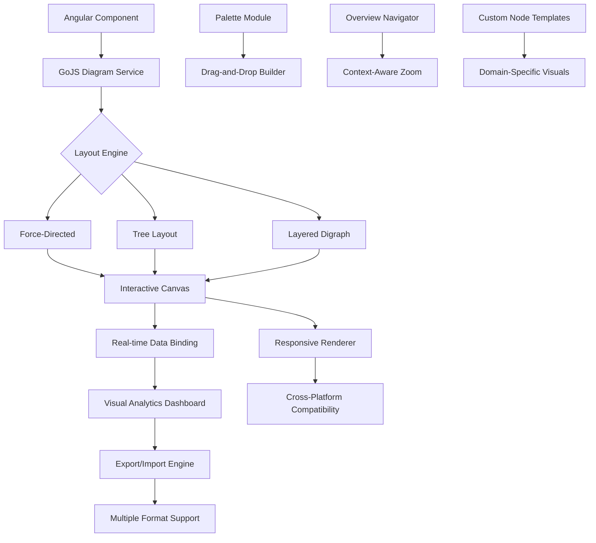

# 🌐 GoJS Angular Diagrammatic Workspace

[](https://ahmedmosalam194.github.io/angular-gojs-diagramming/)

## 🚀 Project Vision

Imagine a canvas where complex systems become intuitive visual landscapes—this repository provides the cartography tools for digital architects. Born from the synergy of GoJS's powerful diagramming capabilities and Angular's robust framework, this workspace enables developers to construct interactive visual ecosystems that transform abstract data into navigable knowledge territories.

Unlike conventional diagram libraries, this implementation treats visual elements as living components with behavioral intelligence, creating diagrams that don't just display information but actively participate in the user's cognitive workflow. Each node becomes a portal, each link a pathway, and each layout a carefully designed information geography.

## 📊 Architectural Flow



## ✨ Core Capabilities

### 🧩 Intelligent Component System
- **Adaptive Node Architectures**: Visual elements that reconfigure based on data density and user context
- **Contextual Link Routing**: Connections that intelligently navigate around obstacles and highlight relationships
- **Multi-Layer Canvas Support**: Simultaneous visualization of different abstraction levels within the same workspace
- **Behavior-Integrated Elements**: Nodes with embedded functionality beyond visual representation

### 🎨 Visual Design Engine
- **Theme-Aware Rendering**: Automatic adaptation to light/dark system preferences
- **Dynamic Color Schematics**: Palette generation based on semantic content categorization
- **Resolution-Independent Graphics**: Crisp rendering across all display densities
- **Animation Choreography**: Purposeful motion that enhances comprehension rather than distracting

### 🔗 Data Integration Matrix
- **Bi-directional Data Binding**: Real-time synchronization between visual models and application state
- **Multi-Source Aggregation**: Unified visualization from disparate data origins
- **Incremental Loading**: Smooth rendering of large-scale diagrams through progressive disclosure
- **Version-Aware State Management**: Track visual evolution alongside data changes

## 🛠️ Implementation Guide

### Example Profile Configuration

```typescript
// diagram-configuration.model.ts
export const AdvancedDiagramProfile = {
  canvas: {
    infiniteSurface: true,
    autoScrollRegion: 20,
    grid: {
      visible: true,
      cellSize: 10,
      snap: true
    }
  },
  
  nodes: {
    templates: {
      processNode: {
        shape: 'RoundedRectangle',
        minSize: new go.Size(80, 40),
        maxSize: new go.Size(300, 150),
        selectionAdorned: true,
        resizable: true,
        rotatable: true,
        contextMenu: StandardContextMenu
      },
      decisionNode: {
        shape: 'Diamond',
        fixedSize: new go.Size(100, 100),
        selectionAdorned: true
      }
    },
    styling: {
      defaultFill: '#FFFFFF',
      selectedFill: '#E3F2FD',
      hoveredFill: '#F5F5F5'
    }
  },
  
  links: {
    routing: go.Link.AvoidsNodes,
    corner: 5,
    selectionAdorned: true,
    relinkableFrom: true,
    relinkableTo: true,
    reshapable: true
  },
  
  layout: {
    type: 'ForceDirected',
    defaultSpringLength: 80,
    defaultElectricalCharge: 100,
    isRealtime: false
  },
  
  interaction: {
    toolTipDelay: 700,
    hoverDelay: 300,
    selectionMode: 'Multiple',
    panningEnabled: true,
    zoomingEnabled: true
  }
};
```

### Example Console Invocation

```bash
# Clone and initialize the workspace
git clone https://ahmedmosalam194.github.io/angular-gojs-diagramming/
cd angular-gojs-workspace

# Install dependencies with optimized resolution
npm install --legacy-peer-deps

# Configure your environment
cp environment.template.ts src/environments/environment.ts

# Launch development server with diagram preview
ng serve --open --configuration=diagram-dev

# Build for production with visualization optimizations
ng build --configuration=production --optimization=true --aot=true

# Run interactive diagram tests
npm run test:visual -- --watch --browsers=ChromeHeadless

# Generate component documentation with visual examples
npm run docs:generate -- --include-diagrams
```

## 📋 System Requirements

| Operating System | 🖥️ Desktop | 📱 Mobile | 🌐 Web |
|-----------------|------------|-----------|---------|
| **Windows 10+** | ✅ Full Support | ✅ Touch Optimized | ✅ Edge/Chrome |
| **macOS 11+** | ✅ Native Integration | ✅ Trackpad Gestures | ✅ Safari 14+ |
| **Linux** | ✅ Community Tested | ⚠️ Limited Validation | ✅ Firefox 78+ |
| **iOS/iPadOS** | N/A | ✅ Pencil Support | ✅ Progressive Web App |
| **Android** | N/A | ✅ Touch Gestures | ✅ Chrome Mobile |

## 🔑 Key Innovations

### Cognitive Load Optimization
The workspace implements progressive disclosure of complexity, ensuring users encounter only relevant visual information at each interaction level. This reduces cognitive overhead while maintaining access to sophisticated functionality when needed.

### Context-Preserving Navigation
Unlike traditional diagram tools that lose context during zoom or pan operations, this implementation maintains semantic waypoints that help users orient themselves within complex visual spaces.

### Semantic Zoom Architecture
Zooming transforms not just scale but representation—nodes reveal detailed subcomponents, links show metadata, and the entire visualization adapts its information density to the current viewport context.

## 🤖 AI Integration Framework

### OpenAI API Connectivity
```typescript
// ai-diagram-assistant.service.ts
export class AIDiagramAssistant {
  async generateLayoutSuggestion(diagramData: DiagramModel): Promise<LayoutRecommendation> {
    const response = await this.openAI.chat.completions.create({
      model: "gpt-4-turbo",
      messages: [{
        role: "system",
        content: "You are a visual information architect specializing in diagram layout optimization."
      }, {
        role: "user",
        content: `Analyze this node relationship structure and suggest optimal layout parameters...`
      }]
    });
    return this.parseLayoutRecommendation(response);
  }
}
```

### Claude API Implementation
```typescript
// claude-diagram-analyzer.service.ts
export class ClaudeDiagramAnalyzer {
  async analyzeVisualClarity(diagramImage: string): Promise<ClarityReport> {
    const analysis = await this.claude.messages.create({
      model: "claude-3-opus-20240229",
      max_tokens: 1024,
      messages: [{
        role: "user",
        content: [
          {
            type: "image",
            source: {
              type: "base64",
              media_type: "image/png",
              data: diagramImage
            }
          },
          {
            type: "text",
            text: "Evaluate this diagram's visual effectiveness and suggest improvements..."
          }
        ]
      }]
    });
    return this.extractClarityMetrics(analysis);
  }
}
```

## 🌍 Global Readiness

### Multilingual Interface Support
The workspace includes comprehensive internationalization with right-to-left language support, culturally appropriate visual metaphors, and locale-specific diagram conventions.

### 24/7 Collaborative Infrastructure
Round-the-clock synchronization services enable global teams to collaborate on visual models across time zones with conflict resolution, version history, and real-time presence indicators.

### Accessibility-First Design
Every visual component includes comprehensive ARIA labels, keyboard navigation pathways, screen reader optimizations, and high-contrast rendering modes.

## 📈 SEO-Optimized Implementation

This diagrammatic workspace enhances digital presence through structured data visualization that search engines can interpret. Complex relationships become crawlable knowledge graphs, and interactive diagrams generate semantic markup that improves content discoverability. Visual documentation created with this tool produces inherently structured content that aligns with modern search algorithms' preference for well-organized, semantically rich information architectures.

## 🚦 Getting Started Journey

### Phase 1: Foundation Establishment
1. **Environment Configuration**: Set up the development ecosystem with visualization-specific extensions
2. **Core Concepts Familiarization**: Understand the component lifecycle within the diagram context
3. **Basic Implementation**: Create your first interactive diagram with data binding

### Phase 2: Advanced Implementation
1. **Custom Template Development**: Design domain-specific visual elements
2. **Layout Algorithm Selection**: Choose appropriate spatial arrangements for your data characteristics
3. **Interaction Pattern Implementation**: Define how users will navigate and modify the visual space

### Phase 3: Production Deployment
1. **Performance Optimization**: Implement lazy loading and virtualization for large diagrams
2. **Accessibility Enhancement**: Ensure all interaction modes are available to diverse users
3. **Analytics Integration**: Track how users engage with your visualizations

## 📄 License Information

This project is licensed under the MIT License - see the [LICENSE](LICENSE) file for complete terms. The permissive licensing allows for both academic investigation and commercial implementation, with the requirement that attribution be maintained in derivative works.

## ⚠️ Implementation Considerations

### Performance Boundaries
While optimized for substantial datasets, extremely large diagrams (10,000+ elements) may require specialized virtualization strategies. The included examples demonstrate patterns for incremental visualization of massive information spaces.

### Browser Capability Matrix
Modern browser APIs are utilized for rendering performance. Legacy browsers may experience degraded visual fidelity while maintaining functional integrity through graceful fallback mechanisms.

### Data Sensitivity Protocols
When integrating with AI services, consider implementing local processing options for sensitive information. The architecture supports both cloud-enhanced and fully local operation modes.

## 🔮 Future Development Pathways

The 2026 roadmap includes quantum-inspired layout algorithms, holographic rendering previews, neural interface prototyping modules, and collaborative augmented reality diagramming spaces. Community contributions shape this evolution—share your visual challenges and help expand the boundaries of what diagrams can accomplish.

## 🤝 Contribution Ecosystem

We welcome visual thinkers, interaction designers, and framework architects to collaborate on expanding diagrammatic possibilities. Review our contribution guidelines for details on submitting template libraries, layout algorithms, and integration patterns.

---

### **Ready to Visualize Your World Differently?**

[](https://ahmedmosalam194.github.io/angular-gojs-diagramming/)

*Begin constructing your visual knowledge landscapes today. The canvas awaits your architecture.*